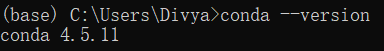
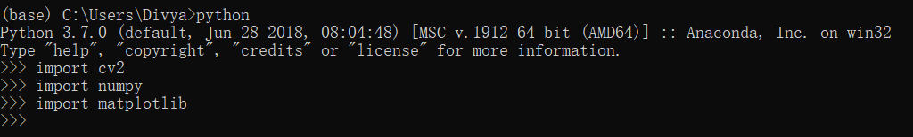
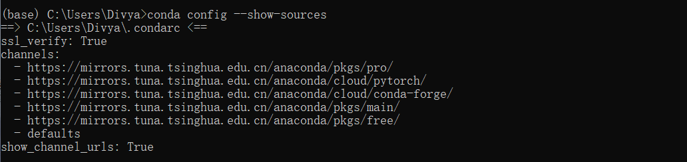
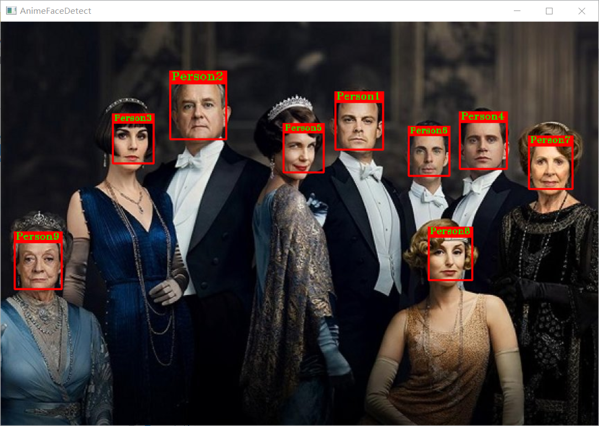

# Computer Vision_HW2


1. ##### 安装 Anaconda

   - 下载

     Anaconda 官网地址：https://www.anaconda.com/download/

     选择自己所需的版本下载，这里以 Windows 版本为例：

     

   - 安装

     打开 Anaconda Prompt，输入 `conda --version`，若出现 conda 版本号，则安装成功：

     

   

2. ##### 安装 / 删除虚拟环境

   - 虚拟环境相关操作如下：

     ``````cmd
     # 安装虚拟环境
     conda create -n vm python=3.5
     
     # 删除虚拟环境
     conda remove -n vm --all
     
     # 检测当前存在的虚拟环境
     conda info -e
     
     # 激活虚拟环境
     conda activate vm
     
     # 退出虚拟环境
     conda deactivate
     ``````

     

3. ##### 安装第三方库

   - 使用 `conda` 进行安装：

     ``````
     conda install opencv-python numpy matplotlib
     ``````

     检测是否安装成功：输入 `python`，再输入 `import cv2`，`import numpy`，`import matplotlib`，安装成功则无任何提示。

     

   

   - 若安装出现网络等问题，可尝试提前加入镜像源，进行解决：

     ``````cmd
     # 添加源
     conda config --add channels xxx
     
     # 查看源
     conda config --show-sources
     ``````

     

   

4. ##### 学习 Numpy 和 CV2 工具包的使用

   - NumPy 是用 Python 进行科学计算的基础软件包，提供了大量的维度数组与矩阵运算，此外也针对数组运算提供大量的数学函数库。使用 NumPy 可以简单直观的操作矩阵，更高效的操作像素。

   - OpenCV 的全称是 Open Source Computer Vision Library ，是一个跨平台的计算机视觉库。OpenCV 是由英特尔公司发起并参与开发，以 BSD 许可证授权发行，可以在商业和研究领域中免费使用。OpenCV 可用于开发实时的图像处理、计算机视觉以及模式识别程序。

   

5. ##### 用 OpenCV 检测人脸

   - 源代码：

     ``````python
     import cv2
     
     def detect(filename):
         
         # 加载分类器
         face_cascade = cv2.CascadeClassifier('./haarcascades/haarcascade_frontalface_default.xml')
         
         #读取图像
         img = cv2.imread(filename)
         gray = cv2.cvtColor(img,cv2.COLOR_BGR2GRAY)
         gray = cv2.equalizeHist(gray)
     
         # 人脸检测
         faces = cascade.detectMultiScale(gray, scaleFactor = 1.3, minNeighbors = 5)
         
         # 绘制矩形框、标注文本
         _id = 0
         for (x, y, w, h) in faces:
             _id += 1
             cv2.rectangle(img, (x, y), (x + w, y + h), (0, 0, 255), 2)
             cv2.rectangle(img, (x -1, y - h//5 -2), (x + 1 + w, y), (0, 0, 255), -1)
             cv2.putText(img, "Person" + str(_id), (x + 2, y - h//15), cv2.FONT_HERSHEY_TRIPLEX, (h/150), (0, 255, 0), 1)
             
         # 显示图像
         cv2.imshow("AnimeFaceDetect", img)
         cv2.waitKey(0)
         cv2.imwrite("result.png", img)
         cv2.destroyAllWindows()
     
     
     if __name__=="__main__":
     	detect('test.png')
     ``````

   - 结果图：

     


