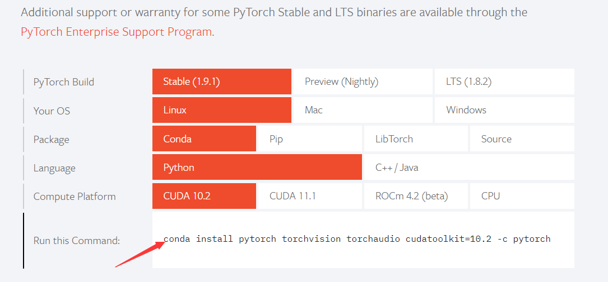
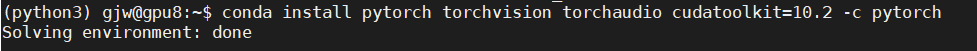
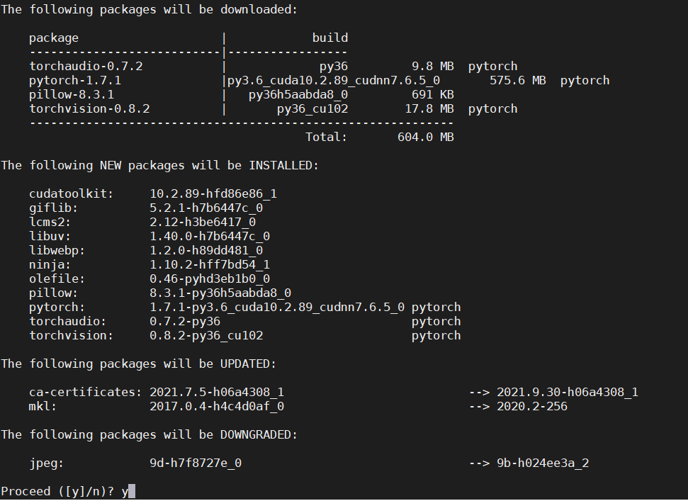
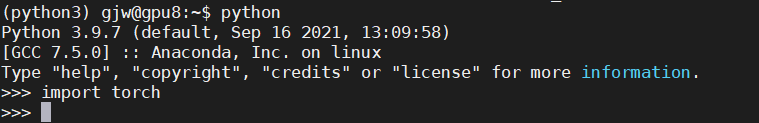

<h1 align="center">
    Computer Vision_HW3
</h1>
<h6 align="center">
    学号：2101212808 | 姓名：郭静文
</h6>
<br>


### 目录

**安装 PyTorch：**[Linux 命令安装](#1.1) | [Windows 使用 Anaconda Navigator 安装](#1.2)

**视频人脸检测：**[基于 OpenCV 视频人脸检测](#2.1) | [使用 OpenCV 自带函数进行图像增强](#2.2) | [基于 Dlib 视频人脸检测](#2.3)  
<br><br>


### 1 安装 PyTorch

#### 1.1  Linux 命令行安装<span id="1.1"></span>

- 根据自己的安装版本，在 pytorch 官网寻找对应安装命令：https://pytorch.org/

  

  

- 复制命令：

  ``````python
  conda install pytorch torchvision torchaudio cudatoolkit=10.2 -c pytorch
  ``````

  

- 进入虚拟环境 `python3` 后，输入命令进行安装 ：

  

  

- 等待安装完成：

  

  

- 输入以下命令，验证是否安装成功：

  ``````python
  python
  import torch
  ``````


- 出现如下界面，至此，安装全部完成：

  


#### 1.2 Windows 使用 Anacoda Navigator 安装<span id="1.2"></span>

- 打开 Anaconda Navigation：选定虚拟环境，搜索 `torch`，点击 `Apply`。

  


- 打开 Acaconnda Prompt，输入如下命令，进行其他 torch 相关库的安装：

  ``````python
  conda install torchvision torchaudio cudatoolkit=10.2 -c pytorch
  ``````

  


<br>
### 2 视频人脸检测

#### 2.1 基于 OpenCV 视频人脸检测<span id="2.1"></span>

- 图像人脸检测函数

  ``````python
  def detect_faces(img):
      # 加载分类器
      face_cascade = cv2.CascadeClassifier('./haarcascades/haarcascade_frontalface_default.xml')
      # 图像预处理
      gray = cv2.cvtColor(img, cv2.COLOR_BGR2GRAY)
      gray = cv2.equalizeHist(gray)
      # 人脸检测
      faces = face_cascade.detectMultiScale(gray, scaleFactor=1.3, minNeighbors=5)
      result = []
      for (x, y, w, h) in faces:
          result.append((x, y, w, h))
      return result
  ``````

  

- 人脸画框及文字标注函数

  ``````python
  def draw_faces(img):
      faces = detect_faces(img)
      if faces:
          _id = 0
          for (x, y, w, h) in faces:
              _id += 1
              cv2.rectangle(img, (x, y), (x + w, y + h), (0, 0, 255), 2)
              cv2.rectangle(img, (x - 1, y - h // 5 - 2), (x + 1 + w, y), (0, 0, 255), -1)
              cv2.putText(img, "Person" + str(_id), (x + 2, y - h // 15), cv2.FONT_HERSHEY_TRIPLEX, (h / 150), (0, 255, 0), 1)
      return img
  ``````

  

- 视频人脸检测函数

  ``````python
  def detect_video(filename=""):
      # f = 0 实时检测人脸，否则从 MP4 文件中检测
      f = 0 if len(filename) <= 0 else filename
  
      # 打开视频捕获设备
      video_capture = cv2.VideoCapture(f)
  
      # 设置检测后的输出文件参数
      width = int(video_capture.get(cv2.CAP_PROP_FRAME_WIDTH))
      height = int(video_capture.get(cv2.CAP_PROP_FRAME_HEIGHT))
      fps = 30
      out = cv2.VideoWriter('out.mp4', cv2.VideoWriter_fourcc(*'mp4v'), fps, (width, height))
  
      while True:
          # 逐帧读取视频
          ret, frame = video_capture.read()
          # 人脸检测并绘制包围框
          new_frame = draw_faces(img=frame)
          # 显示视频
          cv2.imshow('VideoFaceDetect', new_frame)
          # 存储视频
          out.write(new_frame)
          # 退出
          if cv2.waitKey(1) & 0xFF == ord('q'):
              break
  
      # 关闭摄像头设备
      video_capture.release()
      # 关闭所有窗口
      cv2.destroyAllWindows()
  ``````

  

- 检测效果示例：

  

  

- 源代码

  [face_video_detection_opencv.py](./codes/face_video_detection_opencv.py)


#### 2.2 使用 Opencv 自带函数进行图像增强<span id="2.2"></span>

- 调用滤波函数 filter2D 进行卷积

  ``````python
  # 图像预处理 —— 调用滤波函数 filter2D 进行卷积
  kernel=cv2.getGaussianKernel(3, 15)
  img_filter2D=cv2.filter2D(img, -1, kernel)
  ``````

  检测效果示例：

  

  源代码：

  [face_video_detection_opencv_filter2d.py](./codes/face_video_detection_opencv_filter2d.py)

  

- 调用 GaussianBlur 函数

  ``````python
  # 图像预处理 —— 调用 GaussianBlur 函数
  img_gauss=cv2.GaussianBlur(img,(3,3),15,3)
  ``````

  检测效果示例：

  

  源代码：

  [face_video_detection_opencv_gaussianblur.py](./codes/face_video_detection_opencv_gaussianblur.py)

  

#### 2.3 基于 Dlib 视频人脸检测<span id="2.3"></span>

- 安装 Dlib 相关环境

  - 创建并激活 python3.6 环境

    ``````cmd
    conda create -n py36 python=3.6
    conda activate py36 
    ``````

  - 安装 dlib + opencv

    下载 whl 镜像文件：

    [dlib-19.7.0-cp36-cp36m-win_amd64.whl](./packages/dlib-19.7.0-cp36-cp36m-win_amd64.whl)

    [opencv_python-3.4.4.19-cp36-cp36m-win_amd64.whl](./packages/opencv_python-3.4.4.19-cp36-cp36m-win_amd64.whl)

    命令行安装：

    ``````python
    pip install dlib-19.7.0-cp36-cp36m-win_amd64.whl
    pip install opencv_python-3.4.4.19-cp36-cp36m-win_amd64.whl
    ``````

    

- 人脸检测函数（仅需修改此函数，无需修改其他）

  ``````python
  def detect_faces(img):
      # 使用默认的人脸识别器模型
      detector = dlib.get_frontal_face_detector()
      
      # 图像预处理
      gray = cv2.cvtColor(img, cv2.COLOR_BGR2GRAY)
      
      # 人脸检测
      dets = detector(gray, 1)
      result = []
      for face in dets:
          x = face.left()
          y = face.top()
          x_with_w = face.right()
          y_with_h = face.bottom()
          result.append((x, y, x_with_w - x, y_with_h - y))
      return result
  ``````

  

- 检测效果示例：

  

  相较于基于 Opencv 的方法，检测效果有些许提升。

  

- 源代码

  [face_video_detection_dlib.py](./codes/face_video_detection_dlib)

