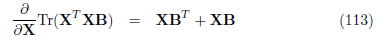
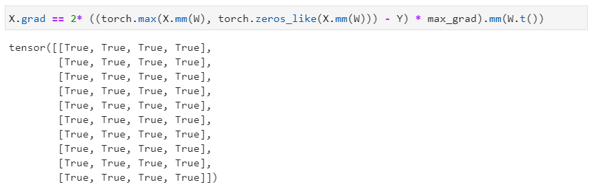

<h1 align="center">
    Computer Vision_HW4
</h1>
<h6 align="center">
    学号：2101212808 | 姓名：郭静文
</h6>

**目录：**[题目](#1) | [解答](#2) | [PyTorch 验证](#3)

### 题目

目标函数：$f=||\max(XW,0)-Y||^2_F$

手动写出以下表达式，并用 PyTorch 进行验证：$\frac{\partial f}{\partial W}$、$\frac{\partial f}{\partial X}$、$\frac{\partial f}{\partial Y}$

### 解答

令 $$Z = \max (XW, 0)$$，则目标函数可化简为 $$f = ||Z-Y||^2_F$$。

利用矩阵的 F 范数的定义：
$$
||A||_F = \sqrt{(\sum_{i=1}^m \sum_{j=1}^n|a_{i,j}|^2)} = \sqrt{(\trace(A^TA))}
$$
将矩阵的 F 范数平方改写为矩阵与自身的内积的迹：
$$ {begin{\align}}
\begin{align}
f 
&= ||Z - Y||^2_F \\
&= tr((Z - Y)^T(Z - Y))\\
&= tr(Z^T Z - Z^T Y - Y^T Z  + Y^T Y)
\end{align}
$$ {end{align}}

参考 [The Matrix Cookbook [Page12-13]](./figs/matrixcookbook.pdf) 给出的矩阵的迹及其微分定理公式：

函数 $$f$$ 分别对 $Z、Y$ 求偏导，可得 $$\frac{\partial f}{\partial Z}$$、$$\frac{\partial f}{\partial Y}$$：
$$
\frac{\partial f}{\partial Z}
= Z + Z - Y - Y = 2(Z - Y)
$$

$$
\frac{\partial f}{\partial Y}
=-2Z + 2Y
= 2(Y-Z)
$$

根据矩阵导数与微分的关系：
$$
df = \trace{({\frac{\partial f}{\partial Z}}^T dZ)}
$$
进一步地，将 $$\frac{\partial f}{\partial Z}$$ 代入，微分 $$df$$ 可以化简为：
$$ {\begin{align}
\begin{align}
df 
&= tr\{2(Z-Y)^T dZ\} \\
&= tr\{2(Z-Y)^T d(\max(XW,0))\} \\
&= tr\{2(Z-Y)^T  \max'(XW,0) \odot d(XW)
\end{align}
$$ {\end{align}
将 $df$ 用 $dW$ 表示并代入：
$$
\begin{align}
df
&= tr\{2(Z-Y)^T \max'(XW,0) \odot X dW\}\\
&=tr\{2[(Z-Y) \odot \max'(XW,0)]^TX dW\}\\
\end{align}
$$
从而推出 $$\frac{\partial f}{\partial W}$$：
$$
\begin{align}
\frac{\partial f}{\partial W}
&= 2 X^T[(Z-Y) \odot \max'(XW,0)]\\
\end{align}
$$
同理，将 $df$ 用 $dX$ 表示并代入：
$$
\begin{align}
df
&= tr\{2(Z-Y)^T \max'(XW,0) \odot (dX)W\}\\
&= tr\{2W(Z-Y)^T \max'(XW,0) \odot dX\}\\
&= tr\{2W [(Z-Y) \odot \max'(XW,0)]^T dX\}
\end{align}
$$
从而推出 $$\frac{\partial f}{\partial X}$$：
$$
\begin{align}
\frac{\partial f}{\partial X}
&=2(Z-Y) \odot \max'(XW,0) W^T \\
\end{align}
$$
综上：
$$
\begin{align}
\frac{\partial f}{\partial W}
&= 2 X^T[(\max(XW,0)-Y) \odot \max'(XW,0)]\\
\end{align}
$$

$$
\begin{align}
\frac{\partial f}{\partial X}
&=2(\max(XW,0)-Y) \odot \max'(XW,0) W^T \\
\end{align}
$$

$$
\frac{\partial f}{\partial Y}
= 2(Y-\max(XW,0))
$$

### PyTorch 验证

构造数据：

计算函数 $f$：

计算梯度：

验证一： $\frac{\partial f}{\partial W} = 2 X^T[(\max(XW,0)-Y) \odot \max'(XW,0)] $

验证二： $\frac{\partial f}{\partial X} = 2(\max(XW,0)-Y) \odot \max'(XW,0) W^T$

验证三： $\frac{\partial f}{\partial Y} = 2(Y-\max(XW,0))$

