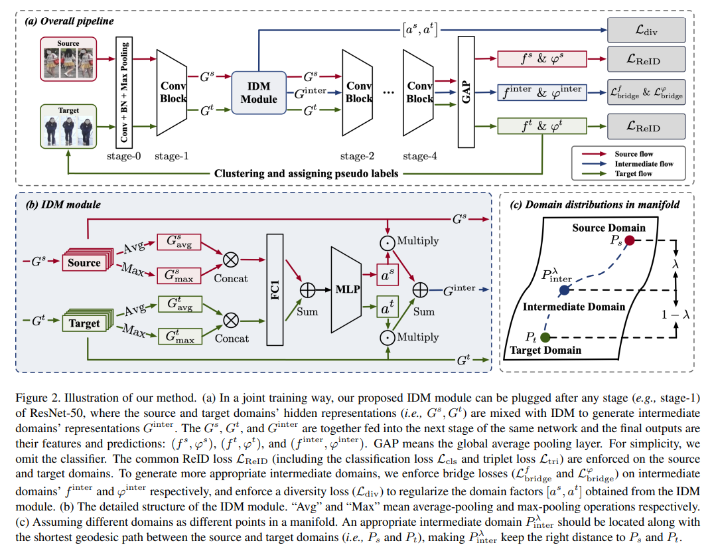
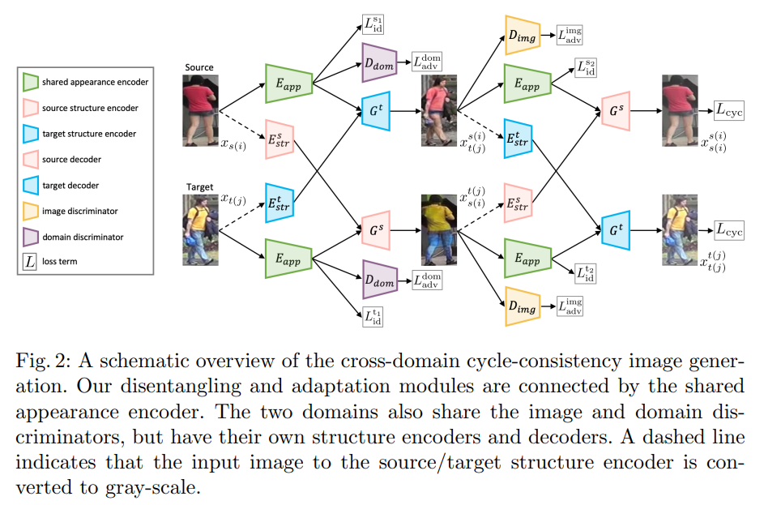
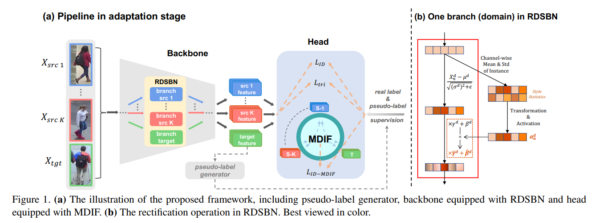
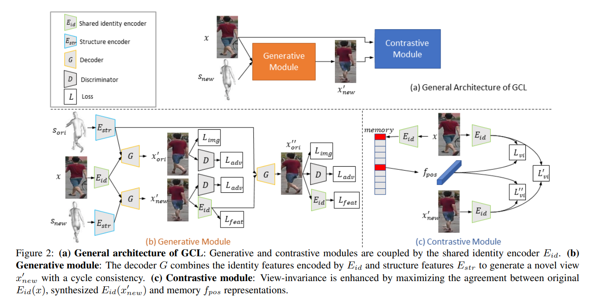
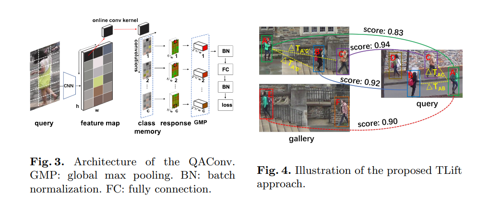
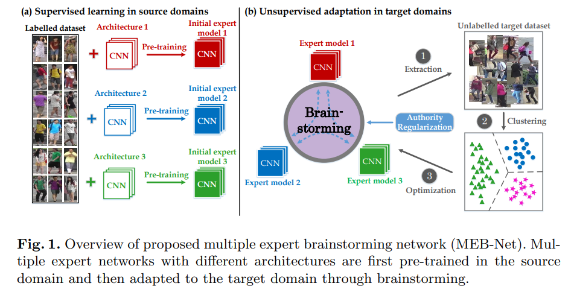
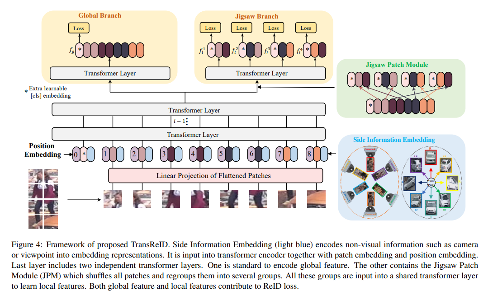

# Person Re-identification Papers

|                   | Title                                                        | Alias                   | Comments       |
| ----------------- | ------------------------------------------------------------ | ----------------------- | -------------- |
| intensive reading | IDM: An Intermediate Domain Module for Domain Adaptive Person Re-ID | [IDM](#IDM)             | ICCV2021, Oral |
|                   | Joint Disentangling and Adaptation for Cross-Domain Person Re-Identification | [DG-Net++](#DG-Net++)   | ECCV2020, Oral |
| extensive reading | Unsupervised Multi-Source Domain Adaptation for Person Re-Identification | [RDSBN](#RDSBN)         | CVPR2021, Oral |
|                   | Group-aware Label Transfer for Domain Adaptive Person Re-identification | [GLT](#GLT)             | CVPR2021       |
|                   | Joint Generative and Contrastive Learning for Unsupervised Person Re-identification | [GCL](#GCL)             | CVPR2021       |
|                   | Interpretable and Generalizable Person Re-identification with Query-adaptive Convolution and Temporal Lifting | [QAConv](#QAConv)       | ECCV2020       |
|                   | Multiple Expert Brainstorming for Domain Adaptive Person Re-identification | [MEB-Net](#MEB-Net)     | ECCV2020       |
|                   | TransReID: Transformer-based Object Re-Identification        | [TransReID](#TransReID) | ICCV2021       |

1. **IDM: An Intermediate Domain Module for Domain Adaptive Person Re-ID (<a id='IDM'>IDM</a>)** 

   *Yongxing Dai, Jun Liu, Yifan Sun, Zekun Tong, Chi Zhang, Ling-Yu Duan*  ICCV, 2021, Oral. [[Paper\]](https://arxiv.org/abs/2108.02413) [[Code\]](https://github.com/SikaStar/IDM?utm_source=catalyzex.com)

   

   
Summary

   提出通过使用即插即用模块建模适当的中间域来考虑源域和 target 域之间的桥接，这有助于 UDA ReID 中两个极端域之间的逐步适应。

   
   

2. **Joint Disentangling and Adaptation for Cross-Domain Person Re-Identification (<a id='DG-Net++'>DG-Net++</a>)** 

   *Yang Zou, Xiaodong Yang, Zhiding Yu, B.V.K. Vijaya Kumar, Jan Kautz*  ECCV, 2021, Oral. [[Paper\]](https://arxiv.org/abs/2007.10315) [[Code\]](https://github.com/NVlabs/DG-Net-PP)

   

   
Summary

   提出一种全新的联合学习框架，首先对原始行人特征进行解耦，得到身份敏感信息（id-related）和身份无关特征（id-unrelated），其后在域适应阶段中将id不相关特征进行剔除，有效提升了跨域 ReID 的性能。

   

   

3. **Unsupervised Multi-Source Domain Adaptation for Person Re-Identification (<a id='RDSBN'>RDSBN</a>)**

   *Zechen Bai, Zhigang Wang, Jian Wang, Di Hu, Errui Ding*  CVPR, 2021, Oral. [[Paper\]](https://arxiv.org/abs/2104.12961)

   

   
Summary

   引入 multi-source 的概念，融合各个域的信息用于UDA ReID。提出校正领域特定批量规范化（RDSBN）模块，减少领域特定特征并增加人物特征的显著性；开发了基于 GCN 的多域信息融合（MDIF）模块，通过融合不同域的特征来最小化域距离。

   

   

4. **Group-aware Label Transfer for Domain Adaptive Person Re-identification(<a id='GLT'>GLT</a>)**

   *Kecheng Zheng, Wu Liu, Lingxiao He, Tao Mei, Jiebo Luo, Zheng-Jun Zha*  CVPR, 2021. [[Paper\]](https://arxiv.org/abs/2103.12366)[[Code\]](https://github.com/zkcys001/UDAStrongBaseline)

   

   
Summary

   提出了一种组感知的标签转移（GLT）算法，将在线标签提炼问题视为最佳传输问题，探索了将 M 个样本分配给 N 个伪标签的最低成本，使伪标签预测和表示学习的在线交互和相互促进。标签转移算法在使用伪标签来训练数据的同时将伪标签细化为在线聚类算法。同时，引入了一种组感知策略，将隐式属性组 id 分配给样本，将在线标签精炼算法与群体感知策略相结合，更好地在线纠正带有噪声的伪标签，缩小目标身份的搜索空间。

   

   

5. **Joint Generative and Contrastive Learning for Unsupervised Person Re-identification(<a id='GCL'>GCL</a>)**

   *Hao Chen, Yaohui Wang, Benoit Lagadec, Antitza Dantcheva, Francois Bremond* CVPR, 2021. [[Paper\]](https://arxiv.org/abs/2012.09071)[[Code\]](https://github.com/chenhao2345/GCL?utm_source=catalyzex.com)

   

   
Summary

   将 GAN 和对比学习模块整合到一个联合训练框架中，提出了一种基于网格的视图生成器（GCL），网格投影用作生成新的人视图的参考；还提出了一种视图不变丢失方法，以促进原始视图和生成视图之间的对比学习。

   

   

6. **Interpretable and Generalizable Person Re-identification with Query-adaptive Convolution and Temporal Lifting(<a id='QAConv'>QAConv</a>)**

   *Shengcai Liao, Ling Shao* ECCV, 2020. [[Paper\]](https://arxiv.org/abs/1904.10424)[[Code\]](https://github.com/shengcailiao/QAConv?utm_source=catalyzex.com)

   

   
Summary

   一种新的卷积方式 QAConv，直接在特征图上对图像的局部特征进行匹配而不去计算特征向量，可以作为一个更好的迁移学习预训练模型，解释性更强，在不使用迁移学习其他 trick 的情况下就能达到和当前很多迁移学习模型等同的泛化能力。

   

   

7. **Multiple Expert Brainstorming for Domain Adaptive Person Re-identification(<a id='QAConv'>MEB-Net</a>)**

   *Yunpeng Zhai, Qixiang Ye, Shijian Lu, Mengxi Jia, Rongrong Ji, Yonghong Tian* ECCV, 2020. [[Paper\]](https://arxiv.org/abs/2007.01546)[[Code\]](https://github.com/YunpengZhai/MEB-Net?utm_source=catalyzex.com)

   

   
Summary

   通过利用多个网络的知识来提升自适应的效果。MEB-Net 采用相互学习的策略，在一个源域内将多个不同结构的网络预先训练成具有特定特征和知识的专家模型，然后通过专家模型之间的相互学习来实现自适应。

   

   

8. **TransReID: Transformer-based Object Re-Identification(<a id='TransReID'>TransReID</a>)**

   *Shuting He, Hao Luo, Pichao Wang, Fan Wang, Hao Li, Wei Jiang* ICCV, 2021. [[Paper\]](https://arxiv.org/abs/2102.04378)[[Code\]](https://github.com/damo-cv/TransReID)

   

   
Summary

   探讨了基于视觉 Transformer 的 ViT，将其用于目标重识别（ReID）任务：以 ViT 为骨干构建了一个强大的基线 ViT-BoT。在多个 ReID 基准上，结果可以与基于 CNN 的框架相提并论。

   

   

   

